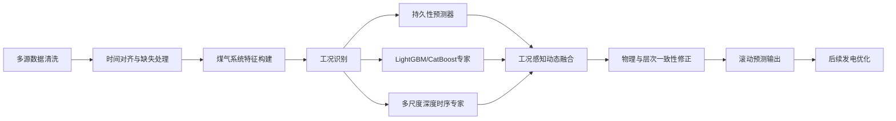

# 煤气发电量预测与发电优化建模思路文档

## 1. 项目概述

### 1.1 赛题背景

钢铁企业在高炉、焦炉和转炉生产过程中会产生大量副产煤气。煤气经过回收净化后，可供生产用户使用，也可送入燃气发电机组进行自发电。

煤气能源系统具有以下特点：

1. 煤气发生量受冶炼生产节奏影响，波动明显；
2. 煤气不适合长期存储，只能通过气柜进行短期缓冲；
3. 生产煤气用户具有较高供气优先级；
4. 发电机组存在容量、稳定负荷、启停和爬坡约束；
5. 不同时段电价不同，需要将煤气资源尽量转移到高电价时段发电。

赛题要求首先预测未来煤气产耗趋势和煤气发电负荷，再根据预测得到的煤气资源边界制定发电计划。短周期为未来 2 小时，长周期为未来 24 小时，且预测过程中禁止使用参考时刻之后的信息。

### 1.2 初赛任务重点

初赛阶段的评分由两部分组成：

$$
\text{初赛成绩}
=
50\%\times \text{数据校验与预处理}
+
50\%\times \text{短周期预测成绩}
$$

因此，初赛阶段应优先完成：

- 四张时序数据表的可靠清洗与时间对齐；
- `generator_1` 和 `generator_all` 的未来 15～120 分钟滚动预测；
- 无未来信息泄露的时间序列验证；
- 符合要求的宽表预测结果生成；
- 模型运行效率、鲁棒性和可复现性建设。

虽然赛题最终还要求发电优化，但初赛不宜过早把主要资源投入完整优化模型。本文仍保留预测—优化一体化的后续扩展方案。

---

## 2. 数据理解与初步审查

### 2.1 数据文件组成

| 文件 | 主要内容 | 建模作用 |
|---|---|---|
| `Pre_gas.csv` | 高炉、焦炉、转炉煤气发生量，热风炉消耗量及进入混气站的煤气量 | 描述煤气供给和部分消耗 |
| `Pre_gas_holder.csv` | 高炉煤气柜柜容 | 描述煤气缓冲状态 |
| `Pre_gas_user.csv` | 高炉煤气用户、转炉煤气用户的消耗量 | 描述生产侧刚性煤气需求 |
| `Pre_load.csv` | 发电机组负荷以及发电消耗的三类煤气量 | 提供预测目标和发电煤气消耗 |
| `data_dictionary.xlsx` | 字段含义、数据文件阶段划分等信息 | 数据解释 |
| `price.xlsx` | 1～12 月、每 30 分钟的分时电价 | 后续优化以及时间工况特征 |

其中：

- `generator_1` 表示 4 套 50 MW 机组的合计负荷；
- `generator_all` 表示全部 6 套机组的总负荷，包括 4 套 50 MW 和 2 套 120 MW 机组；
- 因而理论上应满足：

$$
0\leq generator\_1\leq 200
$$

$$
generator\_1\leq generator\_all\leq 440
$$

### 2.2 数据规模和时间范围

对 CSV 文件进行简单查阅后，数据均覆盖 2025 年 1 月至 4 月末，基本为 15 分钟粒度。不同文件的记录数和时间戳并不完全一致，因此不能按行号横向拼接，必须先创建完整 15 分钟时间轴，再按照 `datetime` 对齐。

需要重点检查：

- 时间戳是否重复；
- 时间间隔是否始终为 15 分钟；
- 各表是否存在单独缺失的时间点；
- 起止时间是否完全一致；
- 不同表相同字段是否存在统计口径差异。

### 2.3 全空字段处理

若某字段在当前阶段全部为空，则不应直接进入模型。设置统一规则：

$$
\text{若字段缺失率}=100\%,\quad \text{则从当前模型输入中剔除}
$$

同时，应在数据质量报告中记录该字段，而不是永久写死删除，以便后续阶段新增有效数据时自动恢复。

### 2.4 零值与设备运行状态

工业煤气数据中的零值不一定是异常值，也可能代表：

- 设备停运；
- 用户暂时不使用某类煤气；
- 煤气掺烧策略切换；
- 高炉、热风炉或转炉处于不同生产阶段；
- 混气站流量切换。

因此不能统一将零值替换或插值，而应构造状态变量：

$$
I_{j,t}^{zero}
=
\begin{cases}
1,&x_{j,t}=0\\
0,&x_{j,t}>0
\end{cases}
$$

进一步构造：

- 连续零值时长；
- 最近一次由零转为非零的时间；
- 最近一次由非零转为零的时间；
- 当前运行状态持续时长；
- 过去 1、2、4 小时内状态切换次数。

### 2.5 目标序列特征

`generator_1` 与 `generator_all` 在短周期内通常具有较强惯性，因此“当前负荷值”本身是重要预测依据。

主模型不宜只从零开始预测未来绝对负荷，而应重点预测相对于当前负荷的变化量：

$$
\Delta y_{t,h}=y_{t+h}-y_t
$$

最终预测为：

$$
\hat y_{t+h}=y_t+\widehat{\Delta y}_{t,h}
$$

这种残差预测方式能够降低模型学习难度，并减少短周期预测抖动。

### 2.6 分布漂移问题

冬季、春季以及不同生产节奏下，负荷水平、煤气产量、用户消耗和气柜状态可能出现明显变化。因此，禁止采用普通随机划分。

随机划分会使训练集和验证集同时包含相邻时刻，从而导致验证分数虚高。应采用滚动时间验证，以模拟真实部署场景。

### 2.7 电价数据特点

`price.xlsx` 以 30 分钟为一个时段，价格主要可划分为尖、峰、平、谷四类。

初赛预测阶段中，电价不是发电负荷的直接决定变量，但企业历史调度行为可能已经受到电价影响，因此可以构造：

- 当前电价；
- 当前电价等级；
- 未来 15～120 分钟已知电价；
- 距离下一次电价切换的时间；
- 当前是否处于高价时段；
- 日内电价变化方向。

---

## 3. 总体建模框架

本文提出“机制引导—工况感知多尺度混合预测模型”，简称：

$$
\boxed{\text{MGR-Mixer}}
$$

英文全称为：

> Mechanism-Guided Regime-aware Multiscale Mixer

总体流程如下：

模型由四个核心部分构成：

1. 持久性预测器；
2. LightGBM/CatBoost 表格特征预测器；
3. 多尺度时序深度预测器；
4. 工况门控融合模块。

最终不是盲目采用单个复杂模型，而是根据预测步长和运行工况动态融合。

---

## 4. 模型准备

### 4.1 多表时间对齐

建立完整的 15 分钟时间轴：

$$
\mathcal T=
\{t_0,t_0+15\text{min},t_0+30\text{min},\ldots\}
$$

所有数据表按照 `datetime` 进行外连接：

$$
D=
D_{\mathrm{gas}}
\Join
D_{\mathrm{holder}}
\Join
D_{\mathrm{user}}
\Join
D_{\mathrm{load}}
$$

连接后增加：

- `missing_gas`；
- `missing_holder`；
- `missing_user`；
- `missing_load`；
- 各变量自身的缺失指示变量。

### 4.2 缺失值处理

#### 4.2.1 短缺口

对于连续缺失不超过 2 个采样点的数据，可采用因果前向填补：

$$
\hat x_t=x_{t-1}
$$

或者使用历史同期中位数：

$$
\hat x_t
=
\operatorname{median}
\left(
 x_{t-96},
 x_{t-192},
 x_{t-288}
\right)
$$

其中 96 表示一天内的 15 分钟采样点数。

在测试和部署阶段，禁止使用 $t+1$ 等未来信息进行双向插值。

#### 4.2.2 长缺口

若连续缺失超过一定长度，则：

- 保留缺失指示变量；
- 使用历史同期中位数填补；
- 降低对应时间窗口的训练权重；
- 若预测标签缺失，则不构造该训练样本。

### 4.3 异常值识别

工业时序中的剧烈变化可能是真实生产事件，因此不能简单使用全局 $3\sigma$ 规则删除。

采用滚动中位数绝对偏差：

$$
MAD_t
=
\operatorname{median}
\left(
|x_i-\operatorname{median}(x)|
\right)
$$

异常得分：

$$
z_t^{MAD}
=
\frac{|x_t-\widetilde x_t|}
{1.4826MAD_t+\varepsilon}
$$

当：

$$
z_t^{MAD}>\tau
$$

时，将该点标记为候选异常。

随后通过多变量一致性进行二次判断：

- 单个传感器突变，而相关变量未变化：倾向判定为传感器异常；
- 煤气产量、气柜、用户消耗和发电负荷同时变化：倾向判定为真实工况变化；
- 某字段瞬时出现极大尖峰并立即恢复：采用局部中位数修正；
- 变化持续多个时间点：保留原值并标记为状态变化。

### 4.4 归一化

对深度模型采用鲁棒归一化：

$$
x'_{j,t}
=
\frac{x_{j,t}-\operatorname{median}(x_j)}
{IQR(x_j)+\varepsilon}
$$

为缓解不同月份和不同工况下的分布漂移，可在深度模型中引入 RevIN。树模型通常不需要标准化，但应使用同一套清洗结果。

---

## 5. 特征工程

### 5.1 时间特征

构造：

- 月份；
- 日期；
- 星期；
- 小时；
- 15 分钟时段编号；
- 是否工作日；
- 日内第几个采样点；
- 当前电价；
- 未来 15～120 分钟的已知电价；
- 当前处于尖、峰、平、谷中的哪一类；
- 距离下一次电价切换的时间。

周期变量采用正余弦编码：

$$
f_{\sin}
=
\sin\left(\frac{2\pi k}{T}\right)
$$

$$
f_{\cos}
=
\cos\left(\frac{2\pi k}{T}\right)
$$

其中：

- $T=96$ 表示日周期；
- $T=672$ 表示周周期。

### 5.2 滞后特征

对主要变量构造：

$$
x_{t-1},x_{t-2},x_{t-3},x_{t-4},x_{t-8},x_{t-12},x_{t-16}
$$

以及日周期和周周期滞后：

$$
x_{t-96},\quad x_{t-192},\quad x_{t-672}
$$

重点变量包括：

- `generator_1`；
- `generator_all`；
- 三类发电煤气消耗量；
- 各高炉煤气发生量；
- 焦炉煤气发生量；
- 转炉煤气发生量；
- 高炉煤气柜柜容；
- 各生产用户消耗量。

### 5.3 差分和变化率特征

一阶差分：

$$
\Delta x_t=x_t-x_{t-1}
$$

二阶差分：

$$
\Delta^2x_t
=
\Delta x_t-\Delta x_{t-1}
$$

相对变化率：

$$
r_t
=
\frac{x_t-x_{t-1}}
{|x_{t-1}|+\varepsilon}
$$

此外构造：

- 过去 30 分钟变化量；
- 过去 1 小时变化量；
- 过去 2 小时变化量；
- 连续上升时长；
- 连续下降时长；
- 当前负荷爬升或下降方向。

### 5.4 滚动统计特征

对窗口：

$$
w\in\{2,4,8,16,32,96\}
$$

分别计算：

$$
\mu_t^{(w)}
=
\frac{1}{w}\sum_{i=0}^{w-1}x_{t-i}
$$

$$
\sigma_t^{(w)}
=
\sqrt{
\frac{1}{w}
\sum_{i=0}^{w-1}
(x_{t-i}-\mu_t^{(w)})^2
}
$$

并构造：

- 最小值；
- 最大值；
- 极差；
- 中位数；
- 分位数；
- 变异系数；
- 线性趋势斜率；
- 最近值与均值偏差；
- 最近值在滚动区间中的百分位位置。

### 5.5 煤气供需聚合特征

#### 5.5.1 高炉煤气总发生量

$$
Q_t^{BFG,prod}
=
\sum_{i\in\mathcal B}Q_t^{BF_i}
$$

#### 5.5.2 热风炉总消耗

$$
Q_t^{heater}
=
\sum_{i\in\mathcal H}Q_t^{heater_i}
$$

#### 5.5.3 高炉煤气用户总消耗

$$
Q_t^{BFG,user}
=
\sum_jQ_t^{BFG,user_j}
$$

#### 5.5.4 高炉煤气观测平衡量

$$
B_t^{BFG}
=
Q_t^{BFG,prod}
-
Q_t^{heater}
-
Q_t^{BFG,user}
-
Q_t^{mixed,BFG}
-
Q_t^{gen,BFG}
$$

该变量理论上与气柜变化相关：

$$
H_{t+1}-H_t
\approx
\alpha B_t^{BFG}
$$

由于匿名化、计量口径和单位可能不完全一致，不将该关系作为严格等式，而将 $\alpha$ 视为可学习系数。

### 5.6 气柜状态特征

设气柜容积为 $H_t$，构造：

$$
\Delta H_t=H_t-H_{t-1}
$$

$$
v_t^H
=
\frac{H_t-H_{t-4}}{4}
$$

进一步构造：

- 气柜过去 1 小时变化量；
- 气柜过去 2 小时变化量；
- 气柜相对历史分位数；
- 气柜低位、中位和高位状态；
- 气柜变化方向；
- 气柜变化与煤气供需平衡量的差异。

若数据字段与题目给出的 20 万立方米总容量不完全同口径，初赛阶段宜使用历史分位数划分状态，而不直接套用 15% 和 90% 阈值。

### 5.7 发电煤气热值融合特征

不同煤气热值不同，不能直接将三类煤气流量等权相加。

构造可学习的等效燃料量：

$$
E_t^{gas}
=
w_BQ_t^{BFG}
+
w_CQ_t^{COG}
+
w_VQ_t^{LDG}
$$

其中：

$$
w_B,w_C,w_V\geq0
$$

权重可在训练集上通过非负回归估计。

进一步构造发电转换效率：

$$
\eta_t
=
\frac{P_t}
{E_t^{gas}+\varepsilon}
$$

模型可利用：

- 当前转换效率；
- 过去 1 小时平均效率；
- 效率变化率；
- 当前效率与历史中位数的偏差。

---

## 6. 预测模型设计

### 6.1 预测形式

采用直接多步预测，而不是递归预测。

输入历史窗口：

$$
\mathbf X_t=
[X_{t-L+1},\ldots,X_t]
$$

直接输出未来 8 个步长：

$$
\hat{\mathbf Y}_t
=
[
\hat y_{t+1},
\hat y_{t+2},
\ldots,
\hat y_{t+8}
]
$$

直接多步预测不会将前一步预测值继续作为后一步输入，因此可以避免误差逐步累积。

### 6.2 基线模型

#### 6.2.1 持久性基线

$$
\hat y_{t+h}=y_t
$$

#### 6.2.2 趋势外推基线

$$
\hat y_{t+h}
=
y_t+h(y_t-y_{t-1})
$$

为避免异常外推，可设置：

$$
|\hat y_{t+h}-y_t|\leq\delta_h
$$

#### 6.2.3 季节性基线

$$
\hat y_{t+h}=y_{t+h-96}
$$

#### 6.2.4 DLinear/NLinear 基线

采用线性趋势与季节分解作为强基线，用于判断复杂深度模型是否真的带来稳定增益。

---

## 7. 表格专家：残差 LightGBM

### 7.1 建模目标

不直接预测 $y_{t+h}$，而是预测：

$$
r_{t,h}=y_{t+h}-y_t
$$

对于两个目标和 8 个步长，共建立：

$$
2\times8=16
$$

个直接预测头。

### 7.2 样本权重

考虑到较新月份更接近测试工况，可对近期样本提高权重：

$$
w_t
=
\exp\left(
-\lambda\frac{T-t}{N}
\right)
$$

对负荷快速变化时段适当提高权重：

$$
w_t'
=
w_t
\left(
1+\gamma
\frac{|\Delta y_t|}
{\operatorname{median}(|\Delta y|)+\varepsilon}
\right)
$$

需设置权重上限，避免极端样本主导训练。

### 7.3 主要作用

LightGBM 专家负责学习：

- 当前值和滞后值关系；
- 设备启停状态；
- 煤气产耗聚合关系；
- 气柜位置；
- 时间和电价工况；
- 大量非线性交互；
- 少量缺失值和异常值。

---

## 8. 深度专家：多尺度外生变量时序网络

### 8.1 模型动机

本赛题同时存在：

1. 15 分钟级局部变化；
2. 小时级趋势；
3. 日周期与周周期；
4. 大量外生变量；
5. 明显的工况切换和分布漂移。

因此，采用轻量多尺度时序网络，并将目标历史序列与煤气产耗等外生变量分开编码。

### 8.2 多尺度输入

设置三个尺度：

#### 近期尺度

过去 2 小时：

$$
L_1=8
$$

重点提取机组瞬时变化。

#### 日内尺度

过去 24 小时：

$$
L_2=96
$$

提取生产节奏和日内周期。

#### 周期尺度

过去 7 天：

$$
L_3=672
$$

该分支可先进行 1 小时降采样，以降低计算量并提取慢趋势。

### 8.3 内生—外生双流结构

#### 内生流

输入：

- `generator_1`；
- `generator_all`；
- 两个目标的一阶、二阶差分；
- 两个目标的滚动统计。

#### 外生流

输入：

- 煤气发生量；
- 热风炉消耗量；
- 生产用户消耗量；
- 气柜状态；
- 发电使用的三类煤气量；
- 时间和电价特征；
- 煤气平衡和效率特征。

两条流分别编码后，通过交叉注意力融合：

$$
Z_t
=
\operatorname{CrossAttention}
\left(
Z_t^{endo},
Z_t^{exo}
\right)
$$

### 8.4 多尺度分解

对每个尺度进行趋势—波动分解：

$$
X_t^{(s)}=T_t^{(s)}+S_t^{(s)}
$$

趋势信息由粗尺度向细尺度传播：

$$
T^{(3)}\rightarrow T^{(2)}\rightarrow T^{(1)}
$$

波动信息由细尺度向粗尺度传播：

$$
S^{(1)}\rightarrow S^{(2)}\rightarrow S^{(3)}
$$

最终融合：

$$
Z_t
=
\sum_{s=1}^{3}\alpha_sZ_t^{(s)}
$$

其中：

$$
\alpha_s
=
\frac{\exp(a_s)}
{\sum_j\exp(a_j)}
$$

---

## 9. 工况感知混合专家

### 9.1 工况划分

至少识别以下工况：

1. 稳态高负荷；
2. 稳态低负荷；
3. 快速升负荷；
4. 快速降负荷；
5. 发电煤气结构切换；
6. 生产用户启停；
7. 数据缺失或传感器异常工况。

工况特征可表示为：

$$
R_t=
[
\Delta P_t,
\sigma_t^P,
\Delta H_t,
B_t^{BFG},
I_t^{zero},
\eta_t,
p_t
]
$$

### 9.2 软门控网络

门控网络输出三个专家的权重：

$$
\boldsymbol{\pi}_t
=
\operatorname{Softmax}(g(R_t))
$$

专家包括：

- 持久性专家；
- LightGBM 残差专家；
- 多尺度深度专家。

最终预测：

$$
\hat y_{t+h}
=
\pi_{t,h}^{P}\hat y_{t+h}^{P}
+
\pi_{t,h}^{L}\hat y_{t+h}^{L}
+
\pi_{t,h}^{D}\hat y_{t+h}^{D}
$$

满足：

$$
\pi_{t,h}^{P}
+
\pi_{t,h}^{L}
+
\pi_{t,h}^{D}
=1
$$

$$
\pi_{t,h}^{k}\geq0
$$

一般情况下：

- 15～30 分钟预测中，持久性专家权重较高；
- 60～120 分钟预测中，树模型和多尺度模型权重逐步增加；
- 稳态下持久性模型更可靠；
- 快速变化工况下残差模型和深度模型更重要。

---

## 10. 层次一致性预测

若直接分别预测 `generator_1` 和 `generator_all`，可能出现：

$$
\hat{generator\_1}>
\hat{generator\_all}
$$

为避免结构冲突，将总负荷拆分为：

$$
P_t^{all}=P_t^{50}+P_t^{120}
$$

其中：

$$
P_t^{50}=generator\_1
$$

$$
P_t^{120}=generator\_all-generator\_1
$$

模型分别预测：

$$
\hat P_{t+h}^{50}
$$

和：

$$
\hat P_{t+h}^{120}
$$

最后计算：

$$
\hat P_{t+h}^{all}
=
\hat P_{t+h}^{50}
+
\hat P_{t+h}^{120}
$$

使用有界输出：

$$
\hat P_{t+h}^{50}
=
200\cdot\sigma(z_{t,h}^{50})
$$

$$
\hat P_{t+h}^{120}
=
240\cdot\sigma(z_{t,h}^{120})
$$

由此自然保证：

$$
0\leq\hat P^{50}\leq200
$$

$$
0\leq\hat P^{120}\leq240
$$

$$
\hat P^{all}\geq\hat P^{50}
$$

---

## 11. 多任务辅助学习

### 11.1 主任务

预测：

- `generator_1`；
- `generator_all`；

或者等价地预测：

- 50 MW 机组群负荷；
- 120 MW 机组群负荷。

### 11.2 辅助任务

同时预测：

- 未来发电使用高炉煤气量；
- 未来发电使用焦炉煤气量；
- 未来发电使用转炉煤气量；
- 未来气柜变化量；
- 未来煤气供需平衡变化。

总损失：

$$
\mathcal L
=
\mathcal L_{\mathrm{load}}
+
\lambda_g\mathcal L_{\mathrm{gas}}
+
\lambda_h\mathcal L_{\mathrm{holder}}
+
\lambda_p\mathcal L_{\mathrm{physics}}
$$

辅助任务不直接参与初赛提交，但可迫使模型学习“煤气资源—发电负荷”关系。

---

## 12. 损失函数设计

### 12.1 相对误差损失

由于官方指标为 MAPE，训练时使用平滑相对误差：

$$
\mathcal L_{rel}
=
\frac{1}{N}
\sum_i
\frac{|y_i-\hat y_i|}
{|y_i|+\varepsilon}
$$

### 12.2 Huber 损失

$$
\mathcal L_{Huber}
=
\begin{cases}
\frac{1}{2}e^2,&|e|\leq\delta\\
\delta(|e|-\frac{1}{2}\delta),&|e|>\delta
\end{cases}
$$

Huber 损失可以降低异常样本对模型训练的影响。

### 12.3 趋势损失

为避免预测曲线过度平滑，增加变化量损失：

$$
\mathcal L_{\Delta}
=
\frac{1}{N}
\sum
\left|
(\hat y_{t+h}-\hat y_{t+h-1})
-
(y_{t+h}-y_{t+h-1})
\right|
$$

### 12.4 物理一致性损失

#### 负荷层次一致性

$$
\mathcal L_{hier}
=
\left|
\hat P^{all}
-
\hat P^{50}
-
\hat P^{120}
\right|
$$

#### 煤气—发电一致性

$$
\mathcal L_{energy}
=
\left|
\hat P_t
-
\left(
\beta_B\hat Q_t^{BFG}
+
\beta_C\hat Q_t^{COG}
+
\beta_V\hat Q_t^{LDG}
+b
\right)
\right|
$$

其中：

$$
\beta_B,\beta_C,\beta_V\geq0
$$

#### 气柜动态一致性

$$
\mathcal L_{holder}
=
\left|
\Delta\hat H_t
-
\alpha\hat B_t^{BFG}
\right|
$$

由于计量口径存在不确定性，上述物理关系只作为软约束。

### 12.5 总损失

$$
\mathcal L
=
\lambda_1\mathcal L_{rel}
+
\lambda_2\mathcal L_{Huber}
+
\lambda_3\mathcal L_{\Delta}
+
\lambda_4\mathcal L_{energy}
+
\lambda_5\mathcal L_{holder}
$$

推荐初始权重：

$$
\lambda_1=1,\quad
\lambda_2=0.2,\quad
\lambda_3=0.1,\quad
\lambda_4=0.05,\quad
\lambda_5=0.02
$$

具体数值通过时间验证集确定。

---

## 13. 时间序列验证设计

### 13.1 滚动验证

推荐设置三个验证折。

#### 验证折一

- 训练：1 月 1 日—2 月 28 日；
- 验证：3 月 1 日—3 月 15 日。

#### 验证折二

- 训练：1 月 1 日—3 月 31 日；
- 验证：4 月 1 日—4 月 15 日。

#### 验证折三

- 训练：1 月 1 日—4 月 16 日；
- 验证：4 月 17 日—4 月 30 日。

最终模型使用全部可用训练数据重新训练。

### 13.2 时间隔离

假设最长输入窗口为 7 天，预测长度为 2 小时，应在训练集和验证集边界处设置隔离区，避免训练窗口和验证标签重叠。

至少满足：

$$
Gap\geq H
$$

更严格时：

$$
Gap\geq L+H
$$

其中 $L$ 为输入长度，$H$ 为预测长度。

### 13.3 评价指标

#### 官方主指标

$$
Score=1-MAPE
$$

分别统计：

- `generator_1` 各步长 MAPE；
- `generator_all` 各步长 MAPE；
- 8 个步长平均值；
- 两个目标的综合平均值。

#### 辅助指标

$$
MAE=
\frac{1}{N}\sum|y_i-\hat y_i|
$$

$$
RMSE=
\sqrt{
\frac{1}{N}\sum(y_i-\hat y_i)^2
}
$$

$$
sMAPE
=
\frac{2|y-\hat y|}
{|y|+|\hat y|+\varepsilon}
$$

同时检查：

- 预测覆盖率；
- 非法值比例；
- 越界率；
- `generator_1 > generator_all` 的比例；
- 单样本推理时间；
- 不同工况下的误差。

---

## 14. 实验方案

### 14.1 基线对比实验

| 编号 | 模型 |
|---|---|
| B1 | 持久性预测 |
| B2 | 趋势外推 |
| B3 | 季节性朴素预测 |
| B4 | Ridge/Elastic Net |
| B5 | DLinear/NLinear |
| B6 | LightGBM 直接多步预测 |
| B7 | CatBoost 直接多步预测 |
| B8 | iTransformer |
| B9 | TimeMixer |
| Proposed | MGR-Mixer 动态融合模型 |

### 14.2 特征消融实验

依次比较：

1. 仅目标历史值；
2. 加入煤气发生量；
3. 加入生产用户消耗；
4. 加入发电煤气消耗；
5. 加入气柜特征；
6. 加入煤气供需平衡特征；
7. 加入设备状态特征；
8. 加入电价和时间特征；
9. 使用全部特征。

### 14.3 模型模块消融

分别删除：

- RevIN；
- 残差预测；
- 多尺度分支；
- 外生变量交叉融合；
- 工况门控；
- 层次一致性输出；
- 辅助煤气预测任务；
- 物理一致性损失；
- LightGBM 专家；
- 持久性专家。

重点回答：

1. 创新模块是否真实提升 MAPE；
2. 提升是否在多个验证折中稳定；
3. 是否只在个别步长有效；
4. 是否增加过多运行时间。

### 14.4 鲁棒性实验

人为构造：

- 随机缺失 1%；
- 连续缺失 30 分钟；
- 连续缺失 1 小时；
- 单字段尖峰异常；
- 某个煤气用户长时间为零；
- 气柜数据缺失；
- 输入变量整体偏移 5%；
- 输入变量噪声增加 5%。

建议将以下指标作为鲁棒性目标：

$$
\frac{
MAPE_{\mathrm{perturbed}}
-
MAPE_{\mathrm{normal}}
}
{MAPE_{\mathrm{normal}}}
<20\%
$$

### 14.5 工况分层实验

按照以下条件分别统计误差：

- 稳态时段；
- 快速升负荷时段；
- 快速降负荷时段；
- 高负荷时段；
- 低负荷时段；
- 气柜快速上升时段；
- 气柜快速下降时段；
- 设备启停切换时段；
- 缺失值附近时段；
- 不同月份；
- 不同电价时段。

---

## 15. 不确定性估计

初赛只要求点预测，但后续优化需要可靠的资源边界，因此建议增加区间预测。

采用分位数损失：

$$
\mathcal L_\tau
=
\begin{cases}
\tau(y-\hat y_\tau),&y\geq\hat y_\tau\\
(1-\tau)(\hat y_\tau-y),&y<\hat y_\tau
\end{cases}
$$

预测：

$$
Q_{0.1},\quad Q_{0.5},\quad Q_{0.9}
$$

随后利用时间序列共形预测校准区间。

初赛提交仍使用中位数或校准后的点预测：

$$
\hat y=Q_{0.5}
$$

---

## 16. 后续发电优化模型

### 16.1 优化框架

后续阶段采用：

$$
\text{概率预测}
+
\text{情景生成}
+
\text{滚动鲁棒混合整数优化}
$$

即 Scenario-based Robust Model Predictive Control。

### 16.2 决策变量

设机组 $i$ 在时段 $t$ 的状态为：

$$
u_{i,t}\in\{0,1\}
$$

发电负荷：

$$
P_{i,t}\geq0
$$

三类发电煤气使用量：

$$
q_{B,t},q_{C,t},q_{V,t}\geq0
$$

气柜柜容：

$$
H_t
$$

煤气放散量：

$$
s_t\geq0
$$

启机变量和停机变量：

$$
v_{i,t},w_{i,t}\in\{0,1\}
$$

### 16.3 机组容量约束

对于额定容量 $P_i^{rated}$：

$$
0.6P_i^{rated}u_{i,t}
\leq
P_{i,t}
\leq
P_i^{rated}u_{i,t}
$$

机组包括：

- 4 套 50 MW；
- 2 套 120 MW。

若数据仅支持机组群级别识别，则初期可简化为：

- 50 MW 机组群；
- 120 MW 机组群。

### 16.4 爬坡约束

题目给定爬坡速率为额定容量的 10%/分钟：

$$
|P_{i,t}-P_{i,t-1}|
\leq
0.1P_i^{rated}\Delta t
$$

当 $\Delta t=15$ 分钟时，该约束可能在普通 15 分钟模型中较弱。因此可采用：

1. 优化内部使用 1 分钟或 5 分钟时间步；
2. 在 15 分钟模型中额外设置经验平滑约束和启停约束。

### 16.5 气柜安全约束

总容量：

$$
H^{cap}=200000\ \mathrm{m^3}
$$

安全区间：

$$
0.15H^{cap}\leq H_t\leq0.90H^{cap}
$$

即：

$$
30000\leq H_t\leq180000
$$

高高柜位：

$$
H_t\leq0.95H^{cap}=190000
$$

优化时应在 90% 之前设置软预警惩罚，而不是等达到 95% 后才处理。

### 16.6 煤气平衡约束

对煤气类型 $g$：

$$
H_{g,t+1}
=
H_{g,t}
+
Q_{g,t}^{prod}
-
Q_{g,t}^{user}
-
Q_{g,t}^{mixed}
-
Q_{g,t}^{gen}
-
s_{g,t}
$$

生产用户优先供应：

$$
Q_{g,t}^{supply,user}
\geq
Q_{g,t}^{demand,user}
$$

发电只能使用满足生产需求后的剩余煤气。

### 16.7 煤气—发电转换约束

$$
P_t
\leq
\eta_Bq_{B,t}
+
\eta_Cq_{C,t}
+
\eta_Vq_{V,t}
$$

其中 $\eta_B,\eta_C,\eta_V$ 通过历史数据估计。

若转换效率随负荷变化，可进一步使用分段线性函数。

### 16.8 优化目标

最大化综合收益：

$$
\max
\sum_t p_tP_t\Delta t
-
\lambda_s\sum_t s_t
-
\lambda_{start}\sum_{i,t}v_{i,t}
-
\lambda_{risk}\sum_t\xi_t
$$

其中：

- 第一项为替代外购电收益；
- 第二项为煤气放散惩罚；
- 第三项为机组启停惩罚；
- 第四项为气柜和供气风险惩罚。

可加入平滑项：

$$
-\lambda_r
\sum_t|P_t-P_{t-1}|
$$

防止调度计划频繁大幅波动。

### 16.9 预测—优化联动

后续阶段可采用决策导向学习：

$$
\min_\theta
\mathcal L_{\mathrm{pred}}(\theta)
+
\lambda
\mathcal L_{\mathrm{decision}}(\theta)
$$

其中：

$$
\mathcal L_{\mathrm{decision}}
=
C(\hat z(\hat y_\theta),y)
-
C(z^*(y),y)
$$

初赛暂不启用该模块，以控制工程复杂度；复赛和决赛再进行端到端微调。

---

## 17. 方案创新点

### 创新点一：围绕持久性基线的残差多步预测

$$
\hat y_{t+h}=y_t+\widehat{\Delta y}_{t,h}
$$

复杂模型只负责学习真正困难的变化部分。

### 创新点二：内生—外生双流多尺度建模

将发电负荷历史和煤气产耗、气柜、用户消耗分开编码，再进行交叉融合。

### 创新点三：工况感知动态专家融合

根据稳态、升负荷、降负荷、设备切换等状态动态融合：

- 持久性模型；
- 树模型；
- 多尺度深度模型。

### 创新点四：机组群层次一致性输出

预测 `generator_1` 与 `generator_all-generator_1`，再求和获得总负荷，从结构上保证总负荷不小于 50 MW 机组群负荷。

### 创新点五：煤气系统软机理约束

通过煤气平衡、气柜动态和等效热值关系辅助模型训练，但不强行使用可能存在口径偏差的硬等式。

### 创新点六：多任务资源预测

在预测负荷的同时预测发电煤气消耗和气柜变化，使模型能够学习煤气资源流向。

### 创新点七：面向后续优化的不确定性输出

利用分位数预测与多步共形校准输出资源区间，为鲁棒发电优化提供情景边界。

---

## 18. 风险与规避措施

| 潜在问题 | 影响 | 规避措施 |
|---|---|---|
| 随机划分数据 | 验证分数虚高 | 使用滚动时间验证 |
| 双向插值 | 引入未来信息 | 测试和上线阶段仅使用因果填补 |
| 把零值当缺失 | 破坏启停状态 | 保留零值并构造状态特征 |
| 复杂模型过拟合 | 线上得分低于持久性 | 保留强基线并动态融合 |
| 直接预测两个目标 | 出现层次冲突 | 预测机组群分量后求和 |
| 煤气单位不一致 | 错误物料平衡 | 使用可学习尺度和软约束 |
| 深度模型过大 | 推理超时 | 使用轻量多尺度结构 |
| 只看总体 MAPE | 忽略突变时段 | 按工况和步长分别评估 |
| 物理修正过强 | 压制真实数据关系 | 不确定机理使用软约束 |
| 后期分布漂移 | 5 月泛化性能下降 | RevIN、近期样本加权和滚动验证 |
| 预测结果越界 | 输出不合法 | 使用结构化有界输出 |
| 特征生成错位 | 严重未来泄露 | 所有滚动统计先滞后一位再计算 |

---

## 19. 推荐实施顺序

### 第一阶段：可靠基线

完成：

1. 时间索引和数据质量报告；
2. 因果缺失处理；
3. 持久性预测；
4. LightGBM 残差预测；
5. 滚动时间验证；
6. 预测输出格式校验。

这一阶段应尽快获得可稳定提交的结果。

### 第二阶段：特征增强

加入：

- 煤气供需聚合；
- 气柜变化；
- 发电效率；
- 设备状态；
- 日周期和周周期；
- 分时电价；
- 月份分布漂移特征。

### 第三阶段：深度专家

训练轻量多尺度内生—外生模型，并检查其是否在多个时间验证折上稳定优于 LightGBM 和持久性。

### 第四阶段：动态融合

根据预测步长和工况学习融合权重，形成最终初赛模型。

### 第五阶段：后续优化预研

提前完成：

- 煤气资源概率预测；
- 气柜动态标定；
- 机组群参数识别；
- 鲁棒 MILP/MPC 优化接口。

---

## 20. 最终推荐方案

初赛最终提交模型建议采用：

$$
\boxed{
\text{持久性预测}
+
\text{LightGBM残差模型}
+
\text{轻量多尺度外生变量模型}
+
\text{工况感知动态融合}
}
$$

具体策略为：

- 15～30 分钟以持久性和树模型为主；
- 45～120 分钟逐步提高多尺度模型权重；
- 使用层次一致性确保输出满足机组结构；
- 使用软机理约束增强煤气—发电关联；
- 使用滚动验证选择最终模型，而不是根据单一验证区间决定；
- 复杂模型只有在多个时间折上稳定超过持久性和 LightGBM 时，才进入最终集成。

该方案既引入多尺度建模、变量交叉融合、动态混合专家、物理约束和共形不确定性等近年工业时序研究中的活跃方法，又保留简单基线、可解释性、运行效率和数据可靠性，避免为了“创新”而无意义堆叠模型。

---

## 21. Typora 使用说明

本文件使用标准 Markdown 与 Typora 支持的 LaTeX 数学公式语法：

- 一级标题：`# 标题`；
- 二级标题：`## 标题`；
- 行内公式：`$公式$`；
- 独立公式：使用 `$$` 包围；
- 表格：标准 Markdown 表格；
- 流程图：使用 Mermaid 代码块。

在 Typora 中建议开启：

1. **偏好设置 → Markdown → Markdown 扩展语法 → 内联公式**；
2. **偏好设置 → Markdown → 代码块 → Mermaid**；
3. 导出 PDF 时选择支持中文和数学公式的主题。
