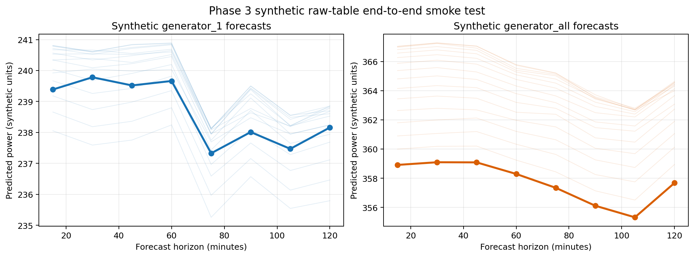

# Phase 3：因果原始表推理链与提交契约实验报告

## 1. 实验结论

本阶段已在**没有读取、枚举、哈希或转换真实“初赛-评分所用测试集”**的前提下，完成四张原始表到 15–120 分钟预测的生产链验证。全部门禁通过，可进入 Python 3.10 干净环境复验；真实评分推理仍须用户再次明确授权。

核心结果：

- 重构后的生产特征在训练期 10,832 个有效样本、801 个冻结特征上与原矩阵逐值一致，最大绝对差为 `0.0`；
- 将合成数据中参考时刻之后的全部有效原始值增加 `1,000,000`，参考时刻的 801 维特征保持不变，最大绝对差为 `0.0`；
- 合成四表端到端链覆盖 800 个 15 分钟时点，最后 16 个参考时刻均生成 8 个预测时距；
- 所有特征和预测均为有限值，且后处理后始终满足 `generator_all >= generator_1`；
- 合成预览严格采用官方 17 列字段顺序，但没有生成正式 `result.csv` 或 ZIP。

## 2. 与赛题要求的对应关系

| 赛题要求 | 本阶段实现 | 验证证据 |
|---|---|---|
| 参考时刻及以前的信息 | 因果填补、正滞后、左闭历史滚动、因果 EWM；推理模块不生成 `label_*` | 未来值对抗性变更后特征差为 0 |
| 多表对齐与缺失处理 | gas、holder、user、load 四表合并到完整 15 分钟网格；短缺口前向填补，长缺口仅用历史季节值或历史中位数 | 合成缺行、单元格缺失均完成端到端推理 |
| 预测未来 15–120 分钟 | 固定 15、30、45、60、75、90、105、120 分钟八个时距 | 合成预览包含两目标共 16 个预测字段 |
| 精确提交格式 | `datetime` 加 `generator_*_t+XX_pred`，共 17 列；UTF-8、至少三位小数 | `synthetic_submission_preview.csv` |
| 禁止测试标签泄漏 | 训练/实验访问策略永久拒绝评分目录；提交读取需要显式、只读、最终推理授权 | 访问策略单元测试通过 |
| 推理运行要求 | 本地合成链约 4 秒，特征训练回放约 7 秒 | 阶段日志与摘要；完整评分规模仍需后续实测 |

## 3. 关键整改

### 3.1 数据访问策略隔离

`assert_training_data_path` 对训练、验证和实验流程永久拒绝任何包含评分目录的路径。未来的提交适配器必须持有 `SubmissionAccessGrant`，其用途必须为 `final_submission_inference`、访问模式必须为只读。策略检查只做路径词法判断，不会主动触碰评分目录。

### 3.2 纯因果预处理

生产预处理被拆成可复用模块。缺失值处理顺序为：当前观测、最多两个点的历史前向填补、过去 1/2/7 天同一时段的中位数、历史扩展中位数。全空字段继续按数据字典和既有实验结论排除，不虚构不可识别数据，改用可观测族聚合特征。

### 3.3 801 维推理特征重构

推理模块只构造当前值、正滞后、历史滚动、日/周季节、运行状态、平滑、跃迁、机理比值和质量标志，不构造任何未来标签。历史增强脚本中的比值回退由潜在非因果的 `bfill` 改为 `ffill + 固定 0 回退`；训练有效区间回放差为 0，说明整改没有改变冻结模型实际接收的训练特征。

### 3.4 提交契约

新增独立提交格式构造器与校验器，检查字段及顺序、时间戳唯一且递增、期望时间覆盖、有限非负值以及机组层级。当前只写出名称明确的合成预览文件，避免被误当成正式提交结果。

## 4. 可视化解读

浅色线表示多个合成参考时刻的八时距预测，深色线表示最后一个参考时刻。该图用于检查预测曲线连续性、不同参考时刻的变化和两个目标量级关系；由于输入完全合成，不能据此评价真实比赛精度。

## 5. 产物与溯源

- 主摘要：`results/phase3_inference_validation/phase3_inference_validation_summary.json`
- 逐特征回放差：`results/phase3_inference_validation/training_feature_replay_differences.csv`
- 合成提交预览：`results/phase3_inference_validation/synthetic_submission_preview.csv`
- 缺失处理统计：`results/phase3_inference_validation/synthetic_imputation_summary.csv`
- 完整运行日志：`results/phase3_inference_validation/phase3_inference_validation.log`
- 产物哈希清单：`results/phase3_inference_validation/phase3_artifact_manifest.json`
- 阶段合规门禁：`results/compliance/phase3_inference_gate.json`
- 可视化：`results/figures_safe/phase3/synthetic_end_to_end_forecasts.png` 与 PDF 版本

## 6. 限制与下一步

1. 当前本机只有 Python 3.9 与 3.13，没有 Python 3.10；工作流已切换到 Python 3.10，需由 GitHub Actions 完成官方版本范围内的干净环境验证。
2. 合成运行时间不能代替真实评分规模的 30 分钟门禁，正式只读推理后仍需记录从原始 CSV 到结果 CSV 的完整耗时。
3. 在用户明确授权前，不读取真实评分目录、不生成正式 `result.csv`、不打包提交 ZIP。
4. 获得授权后只允许加载冻结模型进行推理，不得用评分数据训练、调参、选模或计算真实标签指标。
