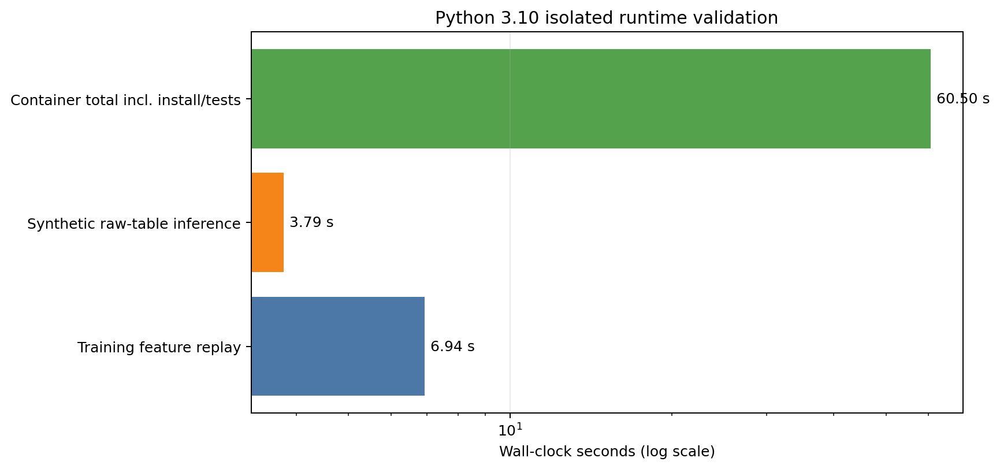

# Phase 4：Python 3.10 隔离运行与提交打包验证实验报告

## 1. 结论

`v0.5.0-inference` 已在官方允许范围内的 Python 3.10 干净容器中完成重新安装、全量测试和合成原始表端到端推理。最终验证全部通过，并完成只含一个 `result.csv` 的合成 ZIP 打包测试。全过程没有挂载、读取、枚举、哈希或转换真实“初赛-评分所用测试集”。

最终结果：

- 环境：`python:3.10-slim`，镜像 ID `sha256:a45c...1852`；
- 容器内测试：21/21 通过；
- 训练期特征回放：10,832 行 × 801 特征，最大绝对差 `0.0`；
- 合成原始表推理：3.788 秒；
- 训练特征回放：6.937 秒；
- 容器总耗时：60.496 秒，包含依赖安装、测试和推理；
- 合成 ZIP：16 行、17 列、UTF-8、至少三位小数，压缩包内仅有根目录 `result.csv`；
- 预测均为有限非负值，并满足 `generator_all >= generator_1`。

## 2. 与赛题要求的联系

| 官方要求 | 本阶段验证 |
|---|---|
| Python 3.8–3.10 | 使用 Python 3.10 官方 slim 镜像完整复验 |
| 全量推理原则上不超过 30 分钟 | 合成全链 3.788 秒；含从零安装和全部测试共 60.496 秒。真实评分规模仍须最终计时 |
| 参考时刻及以前的信息 | 未来数据增加 1,000,000 后参考时刻特征差仍为 0 |
| 15–120 分钟预测 | 两个目标均输出八个固定时距 |
| 17 列、UTF-8、至少三位小数 | SubmissionValidator 和 ZIP 回读验证全部通过 |
| ZIP 内只有 result.csv | 合成包成员严格为 `['result.csv']` |
| 不得使用评分数据训练或调参 | 评分目录没有挂载进容器；仅使用冻结模型和训练派生复现文件 |

## 3. 三次运行与整改过程

### 3.1 第一次：开发依赖缺失

第一次运行完成基础依赖安装后，在 `pytest` 前退出，原因是隔离命令只安装了 `base.txt`，没有安装 `dev.txt`。整改后将开发测试依赖加入容器命令。该失败完整保留在日志中，没有删除或伪装。

### 3.2 第二次：版本私有存档不完整

第二次运行已通过 21 项测试，但特征回放缺少：

- `results/preprocessing/processed/preprocessed_train_causal.csv`；
- `results/features/train_supervised_features_cleaning_enhanced.pkl`。

原因是旧存档白名单只保存模型与日志，无法单靠版本快照完成训练特征重放。已有 `v0.5.0-inference` 坚持不可变，没有覆盖历史。

整改包括：

1. 本次容器以显式白名单补入上述两份训练派生文件，并记录大小与 SHA-256；
2. 更新后续版本存档器，使新版本自动保存因果预处理表、增强训练矩阵和特征目录；
3. 临时沙箱仍不包含原始数据或评分数据。

### 3.3 第三次：完整通过

第三次从 `v0.5.0-inference` 仓库快照重新解压，删除快照自带的旧验证摘要，补入两份哈希固定的训练派生文件，然后在 Python 3.10 中重新生成摘要。21 项测试、特征回放和合成推理全部通过，因此不存在读取旧摘要冒充新结果的问题。

## 4. 提交打包验证

新增打包器以固定时间戳创建可复现 ZIP，并对 ZIP 重新解压检查：

- 成员数必须为 1；
- 唯一成员必须为根目录 `result.csv`；
- CSV 必须为 UTF-8；
- 字段及顺序必须精确匹配 17 列契约；
- 时间戳唯一、递增并覆盖期望起点；
- 预测有限、非负、至少三位小数；
- 两目标满足层级关系。

当前生成的是 `synthetic_contract_test_gas_predict_prelim.zip`，输入完全合成，明确不是正式比赛提交包。

## 5. 可视化

横轴采用对数尺度。合成推理和训练回放只占数秒；容器总耗时主要由从零安装依赖和执行测试构成。该图证明当前链路具有充足时间余量，但正式评分数据行数未知，因此最终 30 分钟门禁仍须在获得只读授权后实测。

## 6. 产物

- Python 3.10 摘要：`results/phase4_runtime_validation/python310_container_validation_summary.json`
- 三次运行完整日志：`results/phase4_runtime_validation/python310_container_validation.log`
- 合成 ZIP 校验摘要：`results/phase4_runtime_validation/synthetic_package_validation_summary.json`
- 合成 ZIP 校验日志：`results/phase4_runtime_validation/synthetic_package_validation.log`
- 合成 ZIP：`results/phase4_runtime_validation/synthetic_contract_test_gas_predict_prelim.zip`
- 合规门禁：`results/compliance/phase4_runtime_packaging_gate.json`
- 产物哈希清单：`results/phase4_runtime_validation/phase4_artifact_manifest.json`
- 固定运行依赖：`requirements/runtime-py310.txt`
- 图表：`results/figures_safe/phase4/python310_runtime_validation.png` 及 PDF

## 7. 下一步边界

Phase 4 结束后，技术上只剩最终评分输入适配与只读执行。该步骤会首次访问评分目录，必须取得用户明确的“授权最终评分只读推理”指令。授权只允许加载冻结模型、推理、校验和打包，不允许训练、调参、选模或利用真实标签计算指标。
