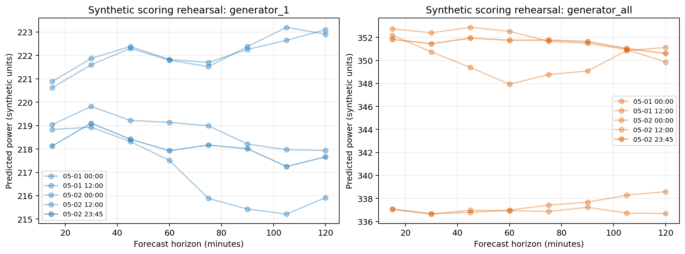

# Phase 5：最终评分只读推理与提交验包实验报告

## 1. 结论

在用户明确授权后，项目完成了初赛评分数据的首次只读推理，并生成了本地最终候选提交包：

- 本地路径：`results/submissions/final/AIC-gas_gas_predict_prelim.zip`；
- ZIP SHA-256：`f0884ebbd8a6a2fbd163c321f8713df4cbbbfb7befc2b565c7d2deda74c9b112`；
- 推理范围：2025-05-01 00:00 至 2025-05-02 23:45，共 192 个参考时点；
- 输出：192 行、17 列，其中 16 列为两个目标在 15–120 分钟八个时距上的预测；
- 总耗时：15.697 秒，远低于 30 分钟门限；
- 输入文件在推理前后的 SHA-256 完全一致；
- 未训练、未调参、未选模，也未计算任何评分标签指标；
- ZIP 内仅有根目录 `result.csv`，编码、列顺序、时间覆盖、小数精度和层级约束均通过两次独立校验。

本阶段只生成并验证了提交候选包，尚未代替参赛者登录竞赛平台上传。提交文件名中的队伍名暂按项目名 `AIC-gas` 处理，如平台登记队伍名不同，应仅修改 ZIP 文件名，不修改包内内容。

## 2. 与赛题要求的对应关系

| 赛题要求 | 本阶段实现与证据 |
|---|---|
| 仅使用参考时刻及以前的信息 | 因果预处理与 801 维冻结特征链；评分特征只由训练历史和截至当前参考时刻的评分输入构造 |
| 预测未来 15–120 分钟 | 两个目标均输出 15、30、45、60、75、90、105、120 分钟八个时距 |
| 初赛评分区间为 5 月 1–2 日 | 精确验证 192 个连续 15 分钟参考时点，起止时间与题面一致 |
| 输出 17 列 | `datetime` 加 16 个预测字段，字段及顺序严格匹配冻结契约 |
| UTF-8、至少三位小数 | ZIP 回读后逐字段检查通过 |
| ZIP 内只含 `result.csv` | 两次独立验包均确认成员列表严格为 `['result.csv']` |
| 原则上 30 分钟内完成 | 正式读取、特征、预测和打包共 15.697 秒 |
| 不得把评分集用于训练 | 评分阶段仅加载冻结模型；清单明确记录 `training_or_tuning_performed=false` |

赛题依据文件为 `docs/competition/official/煤气发电量预测与发电优化-2.pdf`。本阶段没有偏离“煤气发电量多步预测”任务，也没有进入后续发电优化题的决策变量或约束求解环节。

## 3. 执行顺序与失败关闭机制

正式读取评分输入之前，先在完全合成的 192 行评分目录上执行同一适配器：

1. 加载训练期四张原始表；
2. 人工生成与官方评分时段等长、同字段的四张合成表；
3. 合并训练历史与评分窗口，并严格裁去评分起点及以后的训练行；
4. 使用冻结的价格映射、801 维特征顺序、d5/d6 模型和融合参数推理；
5. 生成 17 列结果并打包；
6. 对输入哈希、有限值、非负值、层级关系、时间覆盖和 ZIP 结构进行检查。

合成演练全部通过后，正式程序才接受精确授权令牌。正式读取固定的四个预期文件，不遍历评分目录；任何文件缺失、字段漂移、时间范围异常、非有限预测、层级冲突、输入哈希变化或超时都会使流程失败，不产出“通过”状态。

## 4. 正式推理结果审计

正式阶段合并后的因果时间网格共 11,712 行，评分参考行 192 行，冻结特征数 801。预处理共记录 100 次因果填补事件；特征矩阵和全部预测均为有限值，且满足 `generator_all >= generator_1`。

由于评分输入不含可用于本地核验的真实未来标签，本阶段没有计算 MAPE，也不会依据评分期分布反向调模型。当前唯一可报告的精度证据仍是训练数据上的预注册时间评估：回顾性嵌套外层 MAPE 约 4.7149%，后选择 OOF MAPE 约 5.4671%。这两个数值不能等同于线上成绩。

正式提交包的生成清单与独立复核清单记录了相同 ZIP 哈希，说明二次验包没有改变文件。四个评分输入的逐文件哈希仅记录在清单中，用于证明只读一致性，数据本体不会进入 Git。

## 5. 可视化检查

### 5.1 合成演练图

该图展示五个代表性参考起点的八步预测曲线，用于验证端到端适配器在完整评分长度下不存在形状错位、时距顺序颠倒或数值爆炸。

### 5.2 正式预测诊断图

正式预测诊断图保存于 `results/submissions/final/diagnostics/final_forecast_diagnostics.png`。图中包含五个代表性起点的时距曲线以及全部 192 个起点的 10%–90% 区间和中位数。人工检查未发现 NaN、Inf、负值、明显的时距发散或层级穿越。

该图包含由评分输入派生的预测信息，因此与提交 ZIP 一样仅保存在本地忽略目录，不上传 GitHub。可视化只能验证数值行为，不能替代真实标签精度评估。

## 6. 产物与溯源

- 合成演练摘要：`results/phase5_final_adapter_validation/synthetic_final_adapter_rehearsal_summary.json`；
- 合成演练完整日志：`results/phase5_final_adapter_validation/synthetic_final_adapter_rehearsal.log`；
- 正式推理授权：`results/compliance/final_scoring_authorization.json`；
- 正式推理清单：`results/final_inference_audit/final_scoring_inference_manifest.json`；
- 正式推理完整日志：`results/final_inference_audit/final_scoring_inference.log`；
- 独立二次验包：`results/final_inference_audit/final_submission_independent_audit.json`；
- 二次验包日志：`results/final_inference_audit/final_submission_independent_audit.log`；
- 正式候选提交：`results/submissions/final/AIC-gas_gas_predict_prelim.zip`；
- 正式预测诊断图：`results/submissions/final/diagnostics/final_forecast_diagnostics.png`；
- 阶段产物哈希表：`results/phase5_final_adapter_validation/phase5_artifact_manifest.json`。

提交 ZIP、真实预测诊断图、模型文件和版本归档均进入本地私有白名单，不会通过 GitHub 协作仓库公开。运行日志不含逐行预测值，可随代码、配置、无预测值的审计元数据、合成图和实验报告一并保存到 GitHub，便于团队协作和问题追溯。

## 7. 下一步

1. 确认竞赛平台登记的真实队伍名；若不是 `AIC-gas`，仅重命名 ZIP 为官方模板要求的文件名；
2. 上传前再核对一次 ZIP SHA-256，确保上传对象就是本报告记录的候选包；
3. 获得官方分数后，将成绩、提交时间、平台回执和对应版本标签写入新的实验记录；
4. 不依据评分输入本身改模。若线上结果不理想，只能回到训练期的时间切分、特征和模型实验继续迭代，再生成新的可回退版本。

## 8. 版本归档补充审计

`v0.7.0-submission-rc1` 首次生成了包含冻结模型、训练派生复现文件、最终提交 ZIP、正式诊断图和完整日志的本地私有归档，共 17 个私有文件，且不包含任何 `dataset/` 路径。旧版验证器随后因硬编码 `external_scoring_data_accessed=false` 而拒绝 Phase 5 的真实合规声明；这不是归档损坏，而是历史验证规则没有区分“只读推理已访问评分输入”和“评分数据本体进入归档”。

整改后的验证器要求：访问状态必须是布尔值、`dataset_included` 必须明确为 `false`、正式提交必须与评分访问声明一致、私有 ZIP 成员必须逐项匹配清单，且任一归档中都不得出现 `dataset/`。RC1 保留不覆盖；`v0.7.0-submission-rc2` 已在修复提交上创建，包含 17 个私有文件并通过 4/4 文件校验，同时旧版 `v0.5.0-inference` 和 `v0.6.0-runtime` 回归校验仍通过。
